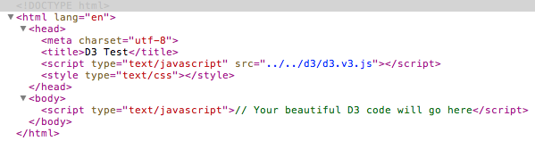
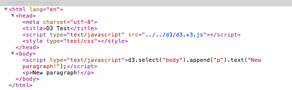

更新时间: 2012-12-30

---

使用D3的第一步是创建一个新DOM元素。一般来说，数据可视化渲染需要生成一个SVG对象，但是我们刚开始就简单一点，做一个`p`段落元素试试。

回到我们之前的HTML的模板：


<!DOCTYPE html>
<html lang="en">
	<head>
		<meta charset="utf-8">
		<title>D3 Test</title>
		
	</head>
	<body>
		
	</body>
</html>


此模板的测试页面在[这里](htmls/40-adding-elements-1.html)。里面其实啥也没有，不过打开你的web inspector，你应该看到如下结果：

然后，修改一下HTML文件，将`script`标签中注释的部分替换为


d3.select("body").append("p").text("New paragraph!");


保存并刷新浏览器(或浏览相应的[测试页面](htmls/40-adding-elements-2.html))，有了！刚刚还空空如也的浏览器中出现了一行字，而web inspector中的内容变成：

看出差别没？在DOM中，出现了一个新的段落元素，而它是实时生成的。这当然还没什么可兴奋的，但是等着吧，马上我们就会用类似的技术动态生成成百上千个元素，而且每个元素都对应于你的一部分数据。

我们还是回顾一下到底发生了什么。上面那句代码其实做了很多事，依次是：

  - 调用D3的`select`方法，它用CSS选择器语法从DOM中选择了一个元素(这里选择了`body`)
  - 创建一个新的`p`元素，然后添加到我们所选元素的末尾，准确地讲是插到了`body`标签中的末尾位置，也就是`</body>`之前。
  - 为新的空段落设置文本内容: New paragraph!

而上面所有这些工作都是用神奇的句点(.)连接在一起，它只不过利用了D3的`链式语法`。

