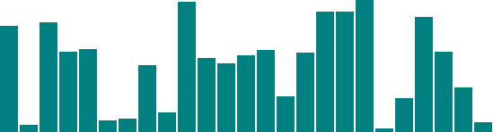
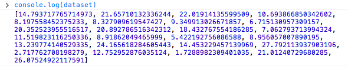
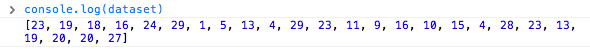

更新时间: 2012-12-30

------

我们考虑一个简单的[柱状图](htmls/90-the-power-of-data-1.html)上，它是用`div`画的，并基于如下简单数据集。


var dataset = [ 5, 10, 15, 20, 25 ];


很强大，但真实世界数据绝非如此简单。我们可以进一步修改数据，得到一个不一样的柱状图。


var dataset = [ 25, 7, 5, 26, 11 ];


而且，还可以不止有5个数据值，想加多少加多少！


var dataset = [ 25, 7, 5, 26, 11, 8, 25, 14, 23, 19,
                14, 11, 22, 29, 11, 13, 12, 17, 18, 10,
                24, 18, 25, 9, 3 ];


我们已经可以画25个数据值了！那如何让D3自动按需扩展呢？


d3.select("body").selectAll("div")
    .data(dataset)  // <-- The answer is here!
    .enter()
    .append("div")
    .attr("class", "bar")
    .style("height", function(d) {
        var barHeight = d * 5;
        return barHeight + "px";
    });


`data()`方法输入中有10个值，则它会遍历10次，如果有100万个值，则它会遍历100万次(只不过会有点慢)。每次遍历都会执行一遍后面的代码。

这就是`data()`方法的强大之处----无论你的数据有多长，它都能全部访问到，并为每个数据值执行一次链后面的方法，而且每次执行中的数据值都会更新为当前值，所以`d`总是指向当前数据值。

这个性质非常重要，即使你现在不觉得，但很快你就会意识到。现在，我建议你先保存上面的示例页面的源码，尝试修改`dataset`，并观察柱状图的变化。

需牢记的是，驱动可视化的永远是`数据`，相比而言，其它因素都是次要的。

## 随机数据

有时候，为了测试或纯粹好玩，你可以生成一些随机数据。[这里](htmls/90-the-power-of-data-4.html)就是一个例子。注意，你每次重新加载网页后，柱状图都是变化的。

查看源码，你会看到如下代码。


var dataset = [];                        //Initialize empty array
for (var i = 0; i < 25; i++) {           //Loop 25 times
    var newNumber = Math.random() * 30;  //New random number (0-30)
    dataset.push(newNumber);             //Add new number to array
}


这段代码没有使用D3中的方法，它是纯粹的JavaScript。先不深究其语法，先说明一下它做了些什么事情。

  - 生成一个空数据组，命名为`dataset`
  - 执行一个`for`循环，共执行25次
  - 每次执行中，生成一个随机数，介于0和30之间
  - 将生成的新数添加到`dataset`数组的后面(`push()`是一个数组方法，它将值添加到数组末尾)

为了验证一下，你可以打开JavaScript终端(console)，并输入`console.log(dataset)`。你应该看到一个随机的长为25的数组。

注意，它们都是带小数的或浮点数(14.793717765714973)，而非我们所需的整数(14)。在我们现在的例子，浮点数也可以用，但如果你需要或坚持要用整数，你可以使用JavaScript的`Math.round()`方法。比如，你可以将下面的代码


var newNumber = Math.random() * 30;


修改成

var newNumber = Math.round(Math.random() * 30);


[尝试一下该代码](htmls/90-the-power-of-data-5.html)，然后使用终端来验证，你会发现它们确实都已经变成了整数。

之前的示例都是基于简单的HTML元素，后面的教程中，我们会探讨基于SVG的可视化。

