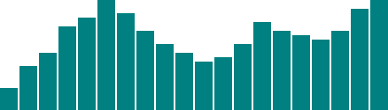
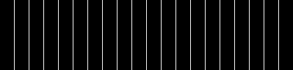
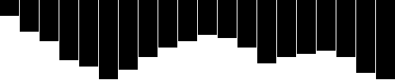
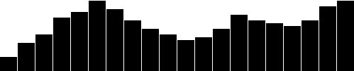
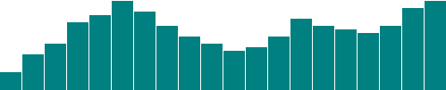
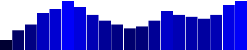
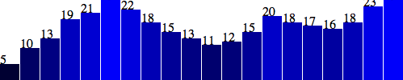
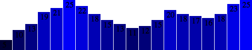
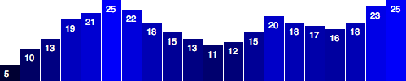

更新时间: 2012-12-30

------

这一节，我们要把前面所学的东西全部用起来，用D3生成一个简单的柱状图。

首先，我们还是先回顾一下之前用`div`元素生成的柱状图。然后，使用`svg`元素改写代码，好处是我们可以更灵活地生成图形。最后，再加上标签，以便更清晰地看到数据值。

## 原来的柱状图
[这里](htmls/130-making-a-bar-chart-1.html)是上次画的柱状图，只不过用了新的数据。


var dataset = [ 5, 10, 13, 19, 21, 25, 22, 18, 15, 13,
                11, 12, 15, 20, 18, 17, 16, 18, 23, 25 ];

d3.select("body").selectAll("div")
    .data(dataset)
    .enter()
    .append("div")
    .attr("class", "bar")
    .style("height", function(d) {
        var barHeight = d * 5;
        return barHeight + "px";
    });


虽然，暂时还想象不出来，但是经过我们进一步改造，这个基于`div`柱状图只会变得更好。

## 新的柱状图
首先，我们先确定SVG的大小。

//Width and height
var w = 500;
var h = 100;

(当然，名字`w`和`h`是任取的，其它名字比如`svgWidth`和`svgHeight`也不错。写代码时，怎么清晰怎么来。JavaScript有尽量提高效率的传统，所以你经常会看到单字符的变量名，代码之间的空格也很少，这种语法在加载效率上肯定更高，但是确实难读。)

然后，我们告诉D3生成一个空的SVG元素，并加到DOM中去：


//Create SVG element
var svg = d3.select("body")
            .append("svg")
            .attr("width", w)
            .attr("height", h);


这相当于将一个新的`<svg>`元素插入到了封闭标签`</body>`之前，并设置其宽高属性为500和100像元。这句话同样将结果保存于变量`svg`中，从而在后面的代码中可以直接引用，而不需要再用`d3.select("svg")`来重新选择。

接下来，我们不再用`div`画矩形，而是生成`rect`元素，并加入到`svg`中。

svg.selectAll("rect")
   .data(dataset)
   .enter()
   .append("rect")
   .attr("x", 0)
   .attr("y", 0)
   .attr("width", 20)
   .attr("height", 100);


这句代码选择`svg`中的所有`rect`元素。当然，它们当前还不存在，所以返回的是一个空选择。(诡异，是的，所以听我进一步解释。在D3，你总是需要先选择将要作用的对象，即使选择的结果为空。)

然后，`data(dataset)`发现数据集中的20个值，所以接着调用`enter()`20次。而`enter()`反过来为每个数据点返回一个占位选择，每个占位选择对应一个`rect`，当然，`rect`仍然是不存在的。

对于这20个占位元素，`append("rect")`在相应的位置上插入一个`rect`元素。我们在前面的[SVG初步](the-svg-primer.html)中已经了解到，每个`rect`必须有`x`,`y`,`width`和`height`属性。所以，我们使用`attr()`来为每个新生成的`rect`添加这些属性。

[结果](htmls/130-making-a-bar-chart-2.html)漂亮否？当然很丑啦！

好吧！我们确实生成了20根柱子，不信，用web inspector查看一下[测试页面](htmls/130-making-a-bar-chart-2.html)的DOM。只不过它们的`x`,`y`,`width`和`height`属性值都是一样的，因此重叠了。这还不是一个数据可视化。

我们先解决重叠的问题。让`x`的值不再为零，而是根据`i`值(也就是数据集中的每个值的位置)动态地变化。让第1个柱子的位置为0，第2个柱子位置为21，接下来是42，依此类推。


.attr("x", function(d, i) {
    return i * 21;  //Bar width of 20 plus 1 for padding
})


这里是该代码的[测试页面](htmls/130-making-a-bar-chart-3.html)。

成功了，但仍然不够灵活。如果数据集太长，则它们会向右延伸到SVG范围之外。因为每个柱子宽度为20，相隔1个像元，因此宽为500个像元的SVG只能容纳23个数据点。比如，下图中的第24个柱子就被裁掉了。

因此，在代码中使用灵活和动态的坐标是个好习惯，比如这里的高度值，宽度值，x和y值。只有这样，可视化结果才能有效反映数据的变化。

鉴于编程的灵活性，你可以有一千种方法实现这个目标。我在这里使用一种简单的，将设置`x`位置的代码修改成


.attr("x", function(d, i) {
    return i * (w / dataset.length);
})


注意，`x`的值是如何与SVG宽度(`w`)和数据点个数(`dataset.length`)发生关系的。现在，我们可以高兴地看到我们的柱状图是均匀分布的。如果有20个数据点，效果为

5个数据点的效果则为

这里是我们目前的代码的[测试页面](htmls/130-making-a-bar-chart-4.html)。

我们还需要让`width`值也动态变化，使得数据点变多时柱子会变窄，数据点变少时变宽。因此，我要增加一个新的变量`barPadding`，表示柱子之间的间隔。


//Width and height
var w = 500;
var h = 100;
var barPadding = 1;  // <-- New!


然后，在设置`width`时引用这个变量。不再用静态的`20`，新的`width`值是SVG宽度的一部分，再减去间隔值。


.attr("width", w / dataset.length - barPadding)


[再次成功！](htmls/130-making-a-bar-chart-5.html)当数据点为20个时，柱子的宽度和x位置都正确地变化。5个时也是对的。

100个数据点的结果也符合预期。

最后，用数据值来设置每个柱子的`height`值。最简单的方法就是直接用数据值`d`来设置`height`

.attr("height", function(d) {
    return d;
});


看起来有些矮。我们可以放大一些。


.attr("height", function(d) {
    return d * 4;  // <-- Times four!
});


唉，不容易啊。可是如果想要让柱子朝上增长而不是现在的朝下，怎么办？这不要怪D3，要怪就怪SVG。

回忆一下[SVG初步](the-svg-primer.html)的内容，当我们画`rect`时，`x`和`y`的值采用的坐标系的原点在左上角。了解了这一点，将坐标系原点变成左下角就很容易了。但这件事还得你自己做，SVG完全不会顾及你的感受。

如果要求柱子从顶端往下生长，那么柱子的顶端和SVG的顶端有什么关系呢？关系很简单，柱子的顶端可以表示为SVG高度和数据值的差。


.attr("y", function(d) {
    return h - d;  //Height minus data value
})


然后，柱子就从`y`位置向下增长到了SVG的底部，因此每个`rect`的高度值可以直接取为数据值。

.attr("height", function(d) {
    return d;  //Just the data value
});


然后，类似地将`d`改成`d*4`，实现垂直方向的拉伸。(设置`y`和`height`的代码都要改。后面，我们会学习D3的缩放功能，这种方式更好用。)
	

[这里](htmls/130-making-a-bar-chart-6.html)是测试页面。

## 颜色
添加颜色相对简单。只需要使用`attr()`设置`fill`属性即可。

.attr("fill", "teal");


[这里](htmls/130-making-a-bar-chart-7.html)全青色的柱状图测试页面。但是，你一般会要求形态的颜色反映了数据的质量。即，将数据编码为颜色。在我们的例子中，数据被双重编码了，因为高度和颜色都用到了数据值。

用数据设计颜色同样只需要定制一个函数，函数中用`d`引用数据值。这里，我们将`"teal"`替换成一个定制的函数。


.attr("fill", function(d) {
    return "rgb(0, 0, " + (d * 10) + ")";
});


[这里](htmls/130-making-a-bar-chart-8.html)是代码的测试页面。这个颜色编码并不是特别有用，但通过这个示例，你可以学到如何将数据转换为颜色。其中，`d`乘以10作为`rgb()`颜色定义中的蓝色值。所以`d`值越大(柱子更高)蓝色更多(更浅)，数值越小蓝色越少(更深，变黑)。

## 标签
图形很炫，但是有时候，你需要在可视化中用文本显示真实地数值。因此我们需要用到标签，而用D3生成标签是非常非常容易的。

回忆一下[SVG初步](the-svg-primer.html)中在SVG元素中添加`text`元素的方式。代码如下

svg.selectAll("text")
   .data(dataset)
   .enter()
   .append("text")


是不是很眼熟？和生成`rect`的代码基本雷同。首先，选择你想要的，给它喂数据，然后生成新元素(占位元素)，最后在DOM中插入新的`text`元素。

将上述代码扩展一下，用`text()`方法将`text`元素的文本内容设置为数据值


.text(function(d) {
        return d;
   })


进一步扩展，可以设置`text`的`x`和`y`值，即文本的位置。最简单的方法是直接复制粘贴前面设置矩形的位置的代码。

.attr("x", function(d, i) {
        return i * (w / dataset.length);
   })
   .attr("y", function(d) {
        return h - (d * 4);
   });


啊！看到数据标签了。只不过它们都跑到柱子外面去了，并且有点歪。稍微往右下移动一点，即`x`和`y`值增加一点点即可。

 .attr("x", function(d, i) {
        return i * (w / dataset.length) + 5;  // +5
   })
   .attr("y", function(d) {
        return h - (d * 4) + 15;              // +15
   });


好点了，但不够清晰。继续改之。


.attr("font-family", "sans-serif")
.attr("font-size", "11px")
.attr("fill", "white");


[棒极了！](htmls/130-making-a-bar-chart-9.html)如果你不是排版控的话，算是可以交差了。但是，如果你和我一样有这毛病，你会发现标签并没有完美地和柱子对齐。要修正这一点也很容易。我们可以使用SVG的`text-anchor`属性来让文本相对于`x`居中显示。


.attr("text-anchor", "middle")


然后，我们要相应地修改`x`的计算方式，令其等于柱子左边界加上半个柱子宽度。

 .attr("x", function(d, i) {
        return i * (w / dataset.length) + (w / dataset.length - barPadding) / 2;
    })

另外，再将标签向上移一个像元，让与顶端的间隔更完美。


 .attr("y", function(d) {
        return h - (d * 4) + 14;  //15 is now 14
    })


[搞定。](htmls/130-making-a-bar-chart-10.html) 从柱状图开始，发挥我们的想象力吧。

