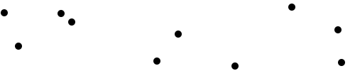
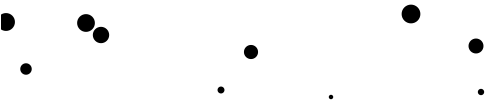
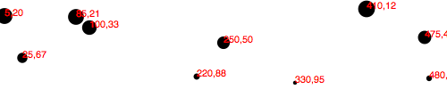

更新时间: 2012-12-30

---

目前为止，我们已经可以用简单数据来绘制柱状图，这类数据集是一维的。

但是，当你有两个数据集，如果想发掘两者之间的关系，你需要第二个维度。散点图(scatterplot)是在两个坐标轴(x和y)上可视化两个数据集的常用工具。

## 数据
在[数据类型]()中已经讲过，你可以灵活地组织数据。对于散点图，我们需要的数据结构是数组的数组。主数组中每个元素表示一个数据点，而每个数据点又由另外一个包含两个值的数组来表示：x和y值。


var dataset = [
                [5, 20], [480, 90], [250, 50], [100, 33], [330, 95],
                [410, 12], [475, 44], [25, 67], [85, 21], [220, 88]
              ];


记住，`[]`表示数组，而嵌套的括号`[[]]`表示数组中包含另一个数组。我们用逗号分隔数组元素，所以包含三个数组的数组形如: `[[],[],[]]`。

为增强可读性，我们的数据集可以写成


var dataset = [
                  [ 5,     20 ],
                  [ 480,   90 ],
                  [ 250,   50 ],
                  [ 100,   33 ],
                  [ 330,   95 ],
                  [ 410,   12 ],
                  [ 475,   44 ],
                  [ 25,    67 ],
                  [ 85,    21 ],
                  [ 220,   88 ]
              ];


这样写之后，每一行对应于一个数据点，共有10行。在第1行中，`[5,20]`表示x值为5，y值为20。

## 散点图
我们可以借用柱状图中的大部分代码，包含创建SVG元素的代码。


//Create SVG element
var svg = d3.select("body")
            .append("svg")
            .attr("width", w)
            .attr("height", h);


但我们不再需要`rect`，而是用圆`circle`来表示每个数据点。

svg.selectAll("circle")
   .data(dataset)
   .enter()
   .append("circle")


类似于`rect`的`x,y,width,height`属性，我们也需要设置`circle`的`cx,cy,r`属性，分别表示圆心x坐标，圆心y坐标和半径。


.attr("cx", function(d) {
        return d[0];
   })
   .attr("cy", function(d) {
        return d[1];
   })
   .attr("r", 5);


[这里是散点图结果](htmls/140-making-a-scatterplot-1.html)。

注意，在设置`cx`和`cy`时我们访问了数据值。当使用`function(d)`时，D3自动将当前数据值传递给函数的参数`d`。在本例中，当前的数据值为大数组`dataset`中的元素，这些元素本身则是小数组。

当`d`是一个数组时(即不是形如`3.14159`之类的单个值)，你需要用中括号来访问它的值。因此，不再是`return d`，而应该是`return d[0]`或`return d[1]`，分别表示返回数组中的第1个值和第2个值。

比如，对于我们的第1个数组点`[5,10]`，它的第1个值(数组位置为`0`)是`5`，而第2个值(数组位置为`1`)是`20`。即


d[0] returns 5
d[1] returns 20


当然，如果你想访问数据集最外面的大数组中的值(比如D3之外的代码)，你也可以使用中括号记号。比如


dataset[5] returns [410, 12]


你也可以将多个中括号连接起来，来访问嵌套数组的值。

dataset[5][1] returns 12


不相信我？再看一看之前的[散点图结果](htmls/140-making-a-scatterplot-1.html)，在JavaScript终端中输入`dataset[5]`或`dataset[5][1]`，看看结果是什么。

## 大小
如果你想让每个圆的大小不同，比如让半径对应于数据点的y值，我们可以定制函数来设置`r`的值。


.attr("r", function(d) {
    return Math.sqrt(h - d[1]);
});


[结果](htmls/140-making-a-scatterplot-2.html)既不漂亮也没什么用，但是这演示了如何结合`d`和中括号，来访问数据值，并设置`r`的值。

## 标签
现在，让我们用`text`元素来为数据点指定标签。这里，我采用了之前柱状图中的标签代码。


svg.selectAll("text")
   .data(dataset)
   .enter()
   .append("text")


这一句代码表示在SVG中寻找所有的`text`元素(尚不存在)，然后为每个数据点添加一个新的`text`元素。接下来，我们就可以用`text()`方法来指定每个元素的内容了。


  .text(function(d) {
        return d[0] + "," + d[1];
   })


这句代码看起来很混乱，不要急，我会进行详细地解释。同样，我们使用了函数`function(d)`来访问数据点。然后，在函数中，我们同时用到了`d[0]`和`d[1]`来访问此数据点中的两个值。

加法`+`符号作用于两个字符串时，相当于将两个字符串拼起来(只要其中一个是字符串，另外一个会转化为字符串)。所以上面这句代码相当于说：获取值`d[0]`和`d[1]`，然后，用逗号将两者连接起来。函数的返回结果当然也是字符串，比如`5,20`，或`25,67`。

接下来，我们需要确定在哪个地方(即`x`和`y`属性)来摆放这些文本。现在，我们只是简单地使用`d[0]`和`d[1]`来指定圆的位置。


 .attr("x", function(d) {
        return d[0];
   })
   .attr("y", function(d) {
        return d[1];
   })


最后，添加一点字体样式


.attr("font-family", "sans-serif")
   .attr("font-size", "11px")
   .attr("fill", "red");


[这里](htmls/140-making-a-scatterplot-3.html)是测试页面。

## 下一步
我希望，到现在，你已经清楚了D3的一些核心概念: 加载数据，生成新元素，使用数据值设置元素的属性。

但是，上面的图像难以称得上是一个合格的数据可视化。散点图并不易读，且代码没有充分利用数据的灵活性。老实说，我们画的东西都比不上Excel的图表工具。

但不要急，D3比起Excel图表炫得多(Clippy就更不要提了)，只不过，生成一个漂亮地交互式的图形需要更高层次的D3技巧。为了灵活使用数据，我们将会学习D3的缩放(scale)功能。为了让散点图更易读，我们还会学习如何生成坐标轴和坐标标签。然后，我们还会学习如何实时更新数据，从而实现交互式可视化。

