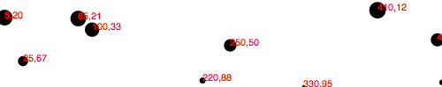
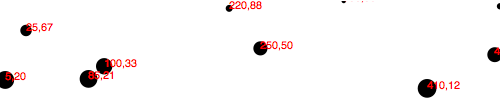
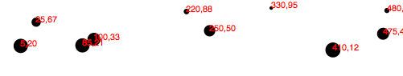
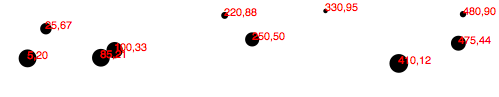
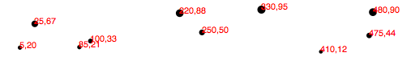
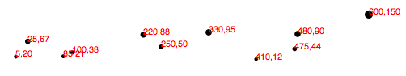
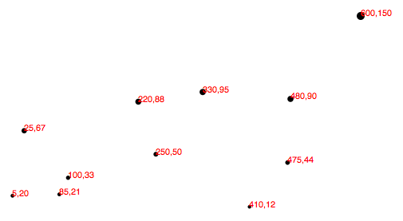

注意，原文中的scale既可以翻译成尺度，又包含缩放的意思。虽然在英文中是一个词，但不同的中文，需要选择不同的翻译。基本原则是，名词翻译成尺度，动作则翻译成缩放。

"尺度是将输入域映射为输出范围的函数"，这是[Mike Bostock对D3尺度的定义](https://github.com/mbostock/d3/wiki/Quantitative-Scales)。

数据集中的值很有可能不会精确对应于可视化中的像元。因此，尺度提供了一种方便的方式，将数据值映射为基于可视化目的的新值。

D3尺度是可以让用户定义参数的函数。一旦生成一个尺度，你可以调用此尺度函数，传入一个数据值，然后它会返回一个缩放后的值。你可以任意定义和使用尺度。

将尺度想像成最终图像中的图形会让人感觉更容易理解，比如表示数值渐进变化的刻度线。但不要被误导了。这些刻度线只不过是坐标轴的一部分，它们本质上只不过是尺度的图形表达。一个尺度是一种数学关系，与图形输出并没有直接关系。我建议读者，将尺度与坐标轴视为两种不同但相关的元素。

这里，我们只讨论线性尺度，因为这也是最常用和最易于理解的类型。一旦你理解了线性尺度，其它尺度只是小菜一碟罢了。

## 苹果和像素
将下面的数据集想像成路边水果摊每个月售出的苹果的个数。


var dataset = [ 100, 200, 300, 400, 500 ];


首先，这是个重大利好消息，因为水果摊每个月都会多卖出100个苹果。说明，经济在增长。为了表现这种上升势头，你希望用一个柱状图来表现苹果销量的变化趋势，每个柱子的高度表现了相应的数据值。

目前为止，我们已经将数据值直接用于显示，而没有考虑单位的差异。所以，如果卖出了500个苹果，柱子的高度应该是500个像元。

这大概是行得通的，但是下个月怎么办？届时可能会卖出600个苹果。而一年以后，卖出1800个苹果怎么办？你的可视化用户不得不购买越来越大的显示屏，只是为了看一下这些过于高的苹果柱子？

这时就显示出尺度的威力了。因为苹果不是像元(桔子也不是像元)，我们需要在它们之间进行缩放变换。

## 输入和输出范围
尺度的输入范围是输入数据值的可能范围。以上面的苹果数据为例，输入范围可以是100和500之间(即数据集的最小和最大值)，也可以是0到500。

尺度的输出范围是输出数据的可能范围，为了方便显示，通常是以像元为单位。输出范围的确定完全取决于你，即信息可视化的设计者。如果你觉得最短的苹果柱子应该是10个像元高度，最高为350像元，则你可以将输出范围设置为10到350。

比如，创建一个输入范围为100,500，而输出范围为10,350的尺度。如果你给该尺度输入值100，则它会返回10，输入500则返回350。如果输入300，则返回180(300刚好是输入范围的中点，180刚好是输出范围的中点)。

我们可以在两个并列的轴上表达输入输出范围:

<svg width="505" height="115">
<text x="220" y="15" font-style="italic">Input domain</text>
<line x1="5" y1="30" x2="500" y2="30" stroke="gray" stroke-width="1"/>
<circle cx="5" cy="30" r="3" fill="#008"/>
<text x="8" y="48">100</text>
<circle cx="255" cy="30" r="3" fill="#008"/>
<text x="258" y="48">300</text>
<circle cx="500" cy="30" r="3" fill="#008"/>
<text x="473" y="48">500</text>
<line x1="5" y1="90" x2="500" y2="90" stroke="gray" stroke-width="1"/>
<circle cx="5" cy="90" r="3" fill="#008"/>
<text x="8" y="84">10</text>
<circle cx="255" cy="90" r="3" fill="#008"/>
<text x="258" y="84">180</text>
<circle cx="500" cy="90" r="3" fill="#008"/>
<text x="473" y="84">350</text>
<text x="220" y="110" font-style="italic">Output range</text>
</svg>

## 归一化
如果你熟悉归一化(normalization)的概念，将非常有助于理解下面的内容。

归一化是根据可能的最小和最大值，将数值映射到0到1之间的数的过程。比如，一年365天，第310对应于0.85年，或一年的85%。

在线性尺度下，D3完全可以帮你处理归一化过程，你不用再担心那些数学问题。输入值首先会被归一化，然后再缩放到输出范围中。

## 创建一个尺度
D3的尺度生成器可以通过`d3.scale`获取，再指定所需的尺度类型即可。


var scale = d3.scale.linear();


恭喜你！你得到了一个名为`scale`的函数，它竟然是可以接受参数的。(不要被`var`所误导，记住，在JavaScript中，变量也是可以存储函数的)


scale(2.5); //Returns 2.5


因为，我们还没有指定输入范围和输出范围，此函数只是一个简单的1:1的尺度。即，无论输入是什么，返回的值都是不变的。

我们可以通过`domain`函数将此尺度的输入范围设置为100,500，参数以数组的形式传入。


scale.domain([100,500]);


输出范围的设置是类似的，用的是`range()`函数


scale.range([10,350]);


上面几个步骤可以分开做，也可以合成一句


var scale = d3.scale.linear()
.domain([100, 500])
.range([10, 350]);


不管你用哪种方式，反正都会得到一个可用的尺度。


scale(100);  //Returns 10
scale(300);  //Returns 180
scale(500);  //Returns 350


一般，你会在`attr()`方法中调用尺度函数，或者单独调用尺度函数。下面，我们将用动态尺度函数来修改我们的散点图可视化。

## 缩放散点图
先回顾一下之前的散点图数据集


var dataset = [
                [5, 20], [480, 90], [250, 50], [100, 33], [330, 95],
                [410, 12], [475, 44], [25, 67], [85, 21], [220, 88]
              ];


回忆一下，此`dataset`是一个数组的数组。我们将数组每个元素的第1个值映射到了x轴上，第2个值映射到y轴上。先从x轴开始。

扫一眼x值，貌似范围是5到480，所以一个合理的输入范围是0,500，对吧?

有人要开始质疑我了。要是换了个数据怎么办？将输入范围写死了，就不够灵活了吧。你说对了。

我们不能将输入范围取为固定值，但我们可以用诸如`min()`和`max()`之类的函数来动态地分析数组的范围。比如，下面的代码循环访问数组的每个x值，然后返回其中的最大值。


d3.max(dataset, function(d) {    //Returns 480
    return d[0];  //References first value in each sub-array
});


结合上述代码，我们在x轴上的尺度函数变成了

var xScale = d3.scale.linear()
                     .domain([0, d3.max(dataset, function(d) { return d[0]; })])
                     .range([0, w]);


首先，要注意的是，我取了个`xScale`的名字，当然，你也可以取任意其它名字。但类似于`xScale`这样的变量名有助于记住其功能。

其次，我将输入范围的下限设置成0，然而，你完全可以用`min()`来动态计算最小值。正如上限被设置为`dataset`的最大x值(这里是480)那样。

最后注意，输出范围设置成了`0,w`，其中`w`是SVG的宽度。

设置y轴上的尺度函数完全类似：

var yScale = d3.scale.linear()
                     .domain([0, d3.max(dataset, function(d) { return d[1]; })])
                     .range([0, h]);


注意，`max()`函数访问的是`d[1]`，即每个子数组的y值。另外，`range()`的上限被设置成SVG的高度`h`。

现在，尺度函数已经就绪。我们剩下的事情就是要去用它们了。简单修改`circle`属性设置的代码


.attr("cx", function(d) {
    return d[0];
})


为经过尺度函数缩放的版本:

.attr("cx", function(d) {
    return xScale(d[0]);
})


类似的，对于y轴，原来的代码

.attr("cy", function(d) {
    return d[1];
})

被修改为

.attr("cy", function(d) {
    return yScale(d[1]);
})


同时，我们也必须修改标签的位置，将代码

.attr("x", function(d) {
    return d[0];
})
.attr("y", function(d) {
    return d[1];
})


修改成


.attr("x", function(d) {
    return xScale(d[0]);
})
.attr("y", function(d) {
    return yScale(d[1]);
})

[结果](htmls/150-scales-1.html)如下。表面上，这看起来和原版没什么区别。但是显然，我们在高技术上走得更远了。

## 改善散点图
你可能早就注意到了，小的y值趋于图表的顶部，大的y值趋于图表的底部。以前，我们需要使用简单的数学计算来将y坐标倒过来，但现在，通过尺度函数，实现这一点更为简便了。具体的做法仅仅是将`yScale`的参数颠倒一下，从

.range([0, h]);

变成

.range([h, 0]);

[结果](htmls/150-scales-2.html)如下。是的，现在小的输入被`yScale`映射到了更大的输出值，因此，也就将表示散点的那些`circle`和`text`上下颠倒过来了。是不是太简单了？

但是，有些元素可能会被裁剪掉了。因此，需要引入一个`padding`变量：


var padding = 20;


然后，在设置两个尺度函数时用上这个`padding`值。原来的`xScale`输入范围是`range([0,w])`，现在变成了

.range([padding, w - padding]);

原来的`yScale`输入范围是`range([h,0])`，现在变成了


.range([h - padding, padding]);

这种做法会在SVG的左端，右端，顶部及底部各留20个像元的空间。结果如下

但是，最右边的标签文本仍然被裁掉一部分了。所以，我们可以将`xScale`右边的边距增加一倍。

.range([padding, w - padding * 2]);


看起来是不是好多了！[这里](htmls/150-scales-3.html)是到目前为止的代码测试页面。但还有一件事需要考虑一下。之前，我们的`cirlce`半径是y值的平方根，我们同样也可以为其定制一个尺度函数。

var rScale = d3.scale.linear()
                     .domain([0, d3.max(dataset, function(d) { return d[1]; })])
                     .range([2, 5]);

然后，设置半径的代码变成

.attr("r", function(d) {
    return rScale(d[1]);
});

这看起来不错，因为它保证了半径值始终位于2和5之间(几乎是这样，参考后面的`clamp()`函数)。所以值`0`(最小输入)对应的半径为`2`(或直径为4像元)，最大的输入值对应的半径为`5`(直径为10个像元)。

[好了](htmls/150-scales-4.html)！摆脱了简单的坐标值，我们终于可以用尺度来设置图形属性了。

最后，假设你还没有被强大的尺度函数搞晕，我还想在数据集中增加一个数据点`[600,150]`:

[成功了！](htmls/150-scales-5.html) 注意，旧的点都保持了相互之间的相对位置，只不过都朝左边挤紧了一点，以躲避右边来的不速之客。

现在，我还可以透露一件事：我们已经可以很容易地修改SVG的大小了，不管你怎么改，里面的内容都会相应地进行缩放。比如，将`h`从`100`变为`300`，结果变为

大家再次欢呼鼓掌！[这里](htmls/150-scales-6.html)是最新的测试页面。我希望，看到上面的结果，你已经意识到：即使客户端决定将图形宽度由800修改为600，你也无需熬夜改代码了。是的，因为我(以及D3的这些内置函数)，你可以睡个大觉了。休息地好是一个竞争优势，苟富贵，勿相忘呀。

## 其它方法
`d3.scale.linear()`还有其它一些好用的方法，值得在这里提一下

  * [nice()](https://github.com/mbostock/d3/wiki/Quantitative-Scales#wiki-linear_nice): 此函数告诉尺度函数将(`range()`函数指定)输入范围的边界映射至最近的"取整"的值上。D3的wiki中给出了一个例子，对于输入范围 [0.20147987687960267, 0.996679553296417]，它的输出将是[0.2,1]。注意，第1个数是0.2而不是0，因为2是第1个非零有效值。这个功能是很有用的，因为类似于0.20147987687960267是很难读的。
  * [rangeRound()](https://github.com/mbostock/d3/wiki/Quantitative-Scales#wiki-linear_rangeRound): 用`rangeRound()`来替换`range()`，则尺度函数所有的输出将会映射至最近的"取整"值。如果你想让图形的坐标与像元精确对齐，以避免模糊边界导致的走样，则此功能很有用。
  * [clamp()](https://github.com/mbostock/d3/wiki/Quantitative-Scales#wiki-linear_clamp): 一个线性尺度函数默认允许返回输出范围之外的值。比如，如果给定一个输入范围之外的输入值，尺度函数的返回值就会跑到输出范围之外。通过对尺度函数调用`.clamp(true)`，会强制所有的输出值都位于指定的输出范围之内。这表示，超过范围的输入值会被映射到输出范围的(最近的)端点上。

## 其它尺度
除了`linear`尺度之外(前面的内容)，D3还内置了其它一些尺度：

  * [identity](https://github.com/mbostock/d3/wiki/Quantitative-Scales#wiki-identity): 1:1尺度，主要用于像素值
  * [sqrt](https://github.com/mbostock/d3/wiki/Quantitative-Scales#wiki-sqrt): 平方根尺度
  * [pow](https://github.com/mbostock/d3/wiki/Quantitative-Scales#wiki-pow): 幂次尺度(利于健身?)
  * [log](https://github.com/mbostock/d3/wiki/Quantitative-Scales#wiki-log): 对数尺度
  * [quantize](https://github.com/mbostock/d3/wiki/Quantitative-Scales#wiki-quantize)`: 输出为离散值的线性尺度，用于将数据归类的情况
  * [quantile](https://github.com/mbostock/d3/wiki/Quantitative-Scales#wiki-quantile): 类似于`quantize`，不同的是输入也是离散值
  * [ordinal](https://github.com/mbostock/d3/wiki/Ordinal-Scales): 有序尺度，输出为非数值的值(比如类别名称)。适合比较苹果和桔子哟。

