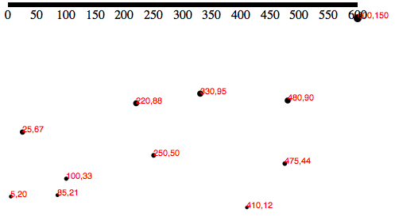
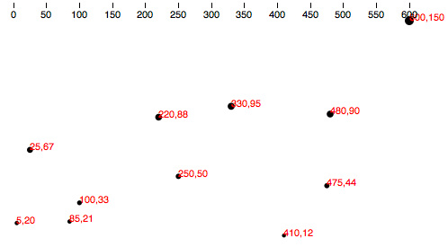
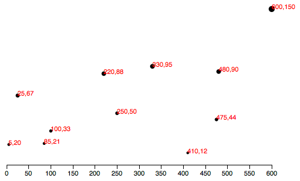
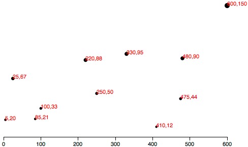
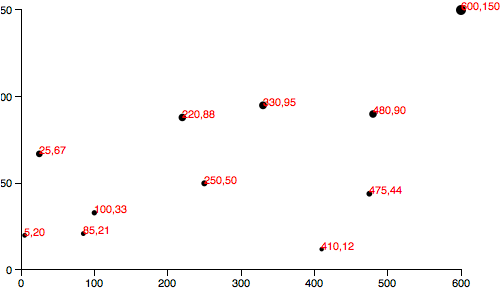
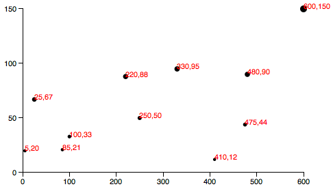
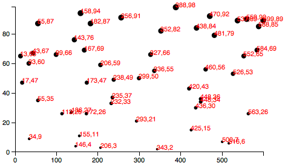
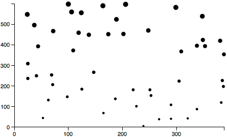
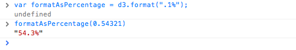

## 坐标轴介绍

## 设置坐标轴

var xAxis = d3.svg.axis();


xAxis.scale(xScale);


xAxis.orient("bottom");


var xAxis = d3.svg.axis()
                  .scale(xScale)
                  .orient("bottom");


svg.append("g")
    .call(xAxis);


svg.append("g")
    .call(d3.svg.axis()
                .scale(xScale)
                .orient("bottom"));


## 清理

svg.append("g")
    .attr("class", "axis")  //Assign "axis" class
    .call(xAxis);


.axis path,
.axis line {
    fill: none;
    stroke: black;
    shape-rendering: crispEdges;
}

.axis text {
    font-family: sans-serif;
    font-size: 11px;
}



svg.append("g")
    .attr("class", "axis")
    .attr("transform", "translate(0," + (h - padding) + ")")
    .call(xAxis);


## 检查坐标轴刻度标记

var xAxis = d3.svg.axis()
                  .scale(xScale)
                  .orient("bottom")
                  .ticks(5);  //Set rough # of ticks


## 要不要Y轴?

//Define Y axis
var yAxis = d3.svg.axis()
                  .scale(yScale)
                  .orient("left")
                  .ticks(5);


//Create Y axis
svg.append("g")
    .attr("class", "axis")
    .attr("transform", "translate(" + padding + ",0)")
    .call(yAxis);



var padding = 30;


## 最后结果

//Dynamic, random dataset
var dataset = [];
var numDataPoints = 50;
var xRange = Math.random() * 1000;
var yRange = Math.random() * 1000;
for (var i = 0; i < numDataPoints; i++) {
    var newNumber1 = Math.round(Math.random() * xRange);
    var newNumber2 = Math.round(Math.random() * yRange);
    dataset.push([newNumber1, newNumber2]);
}


## 坐标轴刻度标签的格式化


var formatAsPercentage = d3.format(".1%");



xAxis.tickFormat(formatAsPercentage);


